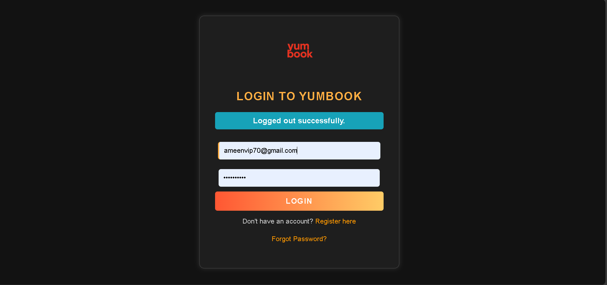
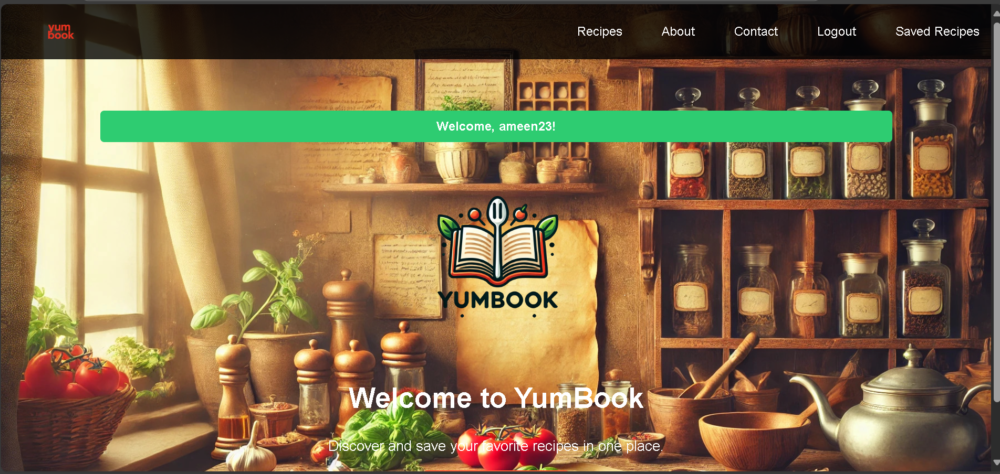
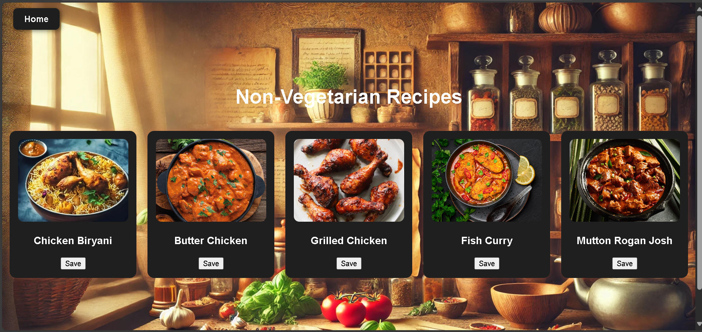
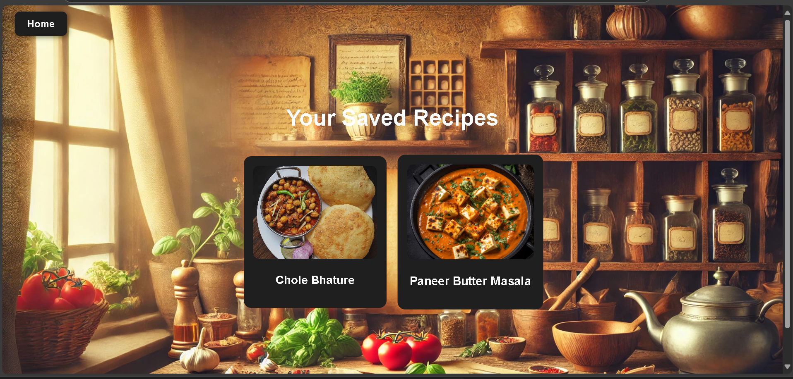

<p align="center">
  
</p>

# 🍽️ YumBook Website


-# 🍽️ YumBook – Recipe Sharing Platform

**YumBook** is a dynamic, user-friendly recipe sharing web application built using **Flask**. It allows users to explore, save, and manage delicious **vegetarian and non-vegetarian recipes** with an elegant dark-themed interface.

📍 **Live Demo**: [https://yumbook-website.onrender.com](https://yumbook-website.onrender.com)

---

## ✨ Features

- 🔐 User registration & secure login (hashed passwords using Flask-Bcrypt)
- 💡 Flash messages for login/logout feedback
- 🔒 Authenticated homepage access
- 📂 Vegetarian and Non-Vegetarian recipe categories
- 🍲 View full recipe details with ingredients & steps
- ❤️ Save your favorite recipes
- 🌓 Dark-themed responsive UI
- 🌐 Deployed on [Render](https://render.com)


## 🖼️ Screenshots

### 🔐 Login Page


### 🏠 Homepage (after login)


### 🧆 Vegetarian Recipes


### 🍗 Non-Vegetarian Recipes


### ❤️ Saved Recipes



## ⚙️ Tech Stack

| Technology | Purpose                            |
|------------|-------------------------------------|
| Python     | Backend logic                       |
| Flask      | Web framework                       |
| SQLite     | Database                            |
| HTML/CSS   | Frontend rendering and styling      |
| Flask-Bcrypt | Password hashing for security     |
| Flask-Login | Session management and auth        |
| Gunicorn   | Production WSGI server              |
| Render     | Cloud deployment                    |

---

## 🚀 Getting Started

### 1. Clone the repository:
```bash
git clone https://github.com/your-username/yumbook.git
cd yumbook